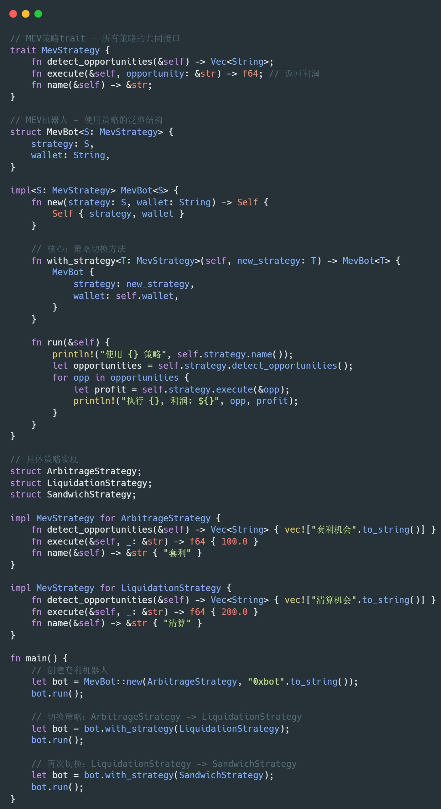

异步队列，mpmc用async_channel，mpsc用tokio::mpsc，广播用 tokio broadcast
同步队列用 crossbeam。一次性的执行结果，用tokio oneeshot。

注意建议用try_send，因为很容易处理不过来，避免服务卡死。

新的库也出现了Kanal这些，看benchmark蛮好的。但是这属于没有积压，就不要动的。

计算超过10ms，建议用rayon的持久线程池，而不是用tokio blocking，因为他是一次性的。

rayon线程池一般原子任务计数、池、sender chan。

99%的情况建议使用非阻塞 tokio spawn+ rayon

建议使用流式处理多worker消费，而非批量处理，因时效性更重要。计算任务前的数据准备采用异步，因涉及较多网络和IO操作，然后封装为计算单元，进入单独线程。

Tokio中计算阻塞与IO阻塞不同，计算阻塞会等待计算完成，IO阻塞则切换至其他任务执行。

这是用rayon的原因

网络部分，如果成熟了，可以使用midleware，一层层封装Inner，然后重写函数。如果没重写的函数，就会按照默认实现，调用内层的函数。

这样的封装是零成本抽象，这也是Rust牛逼的地方。看到一堆的with加功能，就是很好的实践。

trait+泛型，Trait 作为泛型约束很好用，因为就是天然的策略模式，换一个类型就换一种策略。编译器会单态化，编译器会为每个具体类型生成专门的代码，实现零成本抽象。

geyser 和 shred client 使用  solana-stream-sdk 库，可以参考下面链接，
https://github.com/ValidatorsDAO/solana-stream/blob/main/crate/solana-stream-sdk/README.md

## 配置模版
- 根目录提供的 `galileo.yaml` 给出最小可运行示例，可直接复制后补全 RPC、Yellowstone 等敏感信息。
- 上链器与小费策略拆分在 `lander.yaml`，程序会自动加载同目录或 `config/` 下的该文件，方便独立维护 tip、优先费等参数。
- 更详细的字段说明与第三方脚本映射见 `docs/galileo_config_reference.md`。
- 本地调试只想复用线上 Jupiter API 时，可将 `[jupiter.launch].disable_local_binary` 设为 `true`，跳过本地二进制启动。
- 运行时 RPC / Jupiter API 端点配置集中在 `[bot]`，签名账户、共享账户等身份信息位于 `[bot.identity]`。
- 启用 `[strategy]` 段并填写钱包、公链参数后，可执行 `galileo strategy` 启动套利循环（CTRL+C 可安全退出）。

执行 `galileo init` 可在目标目录生成默认的 `galileo.yaml`、`lander.yaml`、`jupiter.toml` 模板；如需覆盖已有文件，附加 `--force`。

常用 CLI 入口：
- `galileo strategy`：根据配置运行套利循环，必要时会自动拉起本地 Jupiter。
- `galileo jupiter start|stop|restart|status|update`：管理本地 Jupiter 二进制（当 `disable_local_binary = false` 且使用本地 URL 时生效）。
- `galileo tools dflow-probe --template copy_tx/template_tx.json`：离线比对 DFlow 动态路由指令的编码输出。
- Jupiter 启动参数解释可参考 `docs/jupiter_cli_options.md`，或使用 `galileo jupiter help` 查看 CLI。

## 缓存系统设计

### 高性能内存缓存

- **DashMap**: 无锁并发池子信息缓存
- **Moka**: 大容量 LRU 缓存用于 Tick/Bin 数组
- **Sled**: 可选的持久化备份

### 性能优势
- **延迟**: 10-50ns vs 100-500μs（Redis）
- **并发**: 无锁读取，支持高并发
- **部署**: 无需额外的 Redis 服务

## 性能设计原则

遵循以下 Rust 性能模式：

### 并发策略
- **异步通道**: 使用 `async_channel` 进行 MPMC，`tokio::mpsc` 进行 MPSC，`tokio::broadcast` 进行广播
- **同步通道**: 使用 `crossbeam` 进行同步队列
- **一次性**: 使用 `tokio::oneshot` 进行单一结果
- **优先 `try_send`** 避免阻塞和服务死锁

### 计算策略
- **Rayon 处理重计算**: 对 >10ms 的任务使用 `rayon` 线程池，而不是 `tokio::spawn_blocking`
- **模式**: 异步数据准备 → 打包为计算单元 → 发送到专用线程
- **流处理**: 优先选择多工作者流处理而非批处理以获得更好的延迟

### 零成本抽象
- **Trait + 泛型**: 使用 trait 作为策略模式的泛型约束
- **中间件模式**: 用 trait 实现分层 `Inner` 类型
- **单态化**: 编译器为每个具体类型生成专门代码

## 关键依赖及其用途

### 核心运行时
- `tokio`: 具有完整功能的异步运行时
- `async-channel`: MPMC 通道
- `crossbeam`: 同步并发原语
- `rayon`: 并行计算

### Solana 集成
- `solana-client`: RPC 客户端
- `solana-sdk`: 核心 SDK 类型
- `anchor-client/lang`: Anchor 程序交互

### 性能库
- `dashmap`: 并发 hashmap
- `moka`: 高性能异步缓存
- `sled`: 轻量级持久化
- `parking_lot`: 快速互斥锁
- `rust_decimal`: 精确十进制数学
- `bincode`: 快速序列化

### 网络
- `tonic`: gRPC 客户端（用于 shred 流）
- `reqwest`: HTTP 客户端

## 代码组织标准

### 文件结构规则
- **绝对不要在 mod.rs 文件中放置结构体、trait 和实现**
- **结构体放在 types.rs 文件中**
- **功能性代码使用适当的命名文件**（例如，管理逻辑使用 manager.rs）
- **mod.rs 文件只应包含模块声明和导出**
